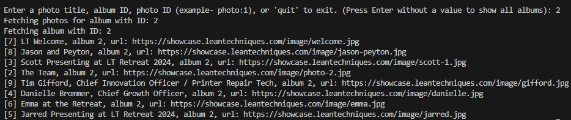

# Lean Showcase API Client

This is a Node.js application to interact with the LeanTechniques Showcase API for retrieving photos by ID, albums, or album photos.

## Features

## Requirements
- Node.js (v14+)
- npm
- `.env`

## Getting Started

1. Clone the repository: https://github.com/SethFoster/POC-photo-album

2. Install dependencies: npm install

3. Set up environment variables:
Create a `.env` file in the root directory with following values:
API_BASE_URL=https://showcase.leantechniques.com
API_KEY=lt_tech_showcase

4. Run the application: npm start

## How to Use the App

Once the application is running, you will be prompted to enter a search term. You can search for:

- A **photo title**
- An **album ID**
- A **photo ID** (e.g., `photo:1`)

Alternatively, you can type **'quit'** to exit the application.

### Example Inputs:
- **photo:1**: Retrieves the photo with ID 1.
- **album ID**: Retrieves all photos from the specified album (e.g., `1` for album ID 1).
- **title**: Searches for photos by title (e.g., typing `lean` will return photos with the word "lean" in the title).
- **[empty input]**: If you press Enter without entering anything, all albums and their photos will be displayed.

### How it works:
- If a **valid input** (e.g., photo ID, album ID, or title) is provided, the app will fetch and display the relevant photos.
- If you **leave the input empty** and press Enter, it will show all available albums and their photos.
- Typing **'quit'** will exit the application.

### Example Prompt:

## Running Tests
Run tests using Jest: npm test
